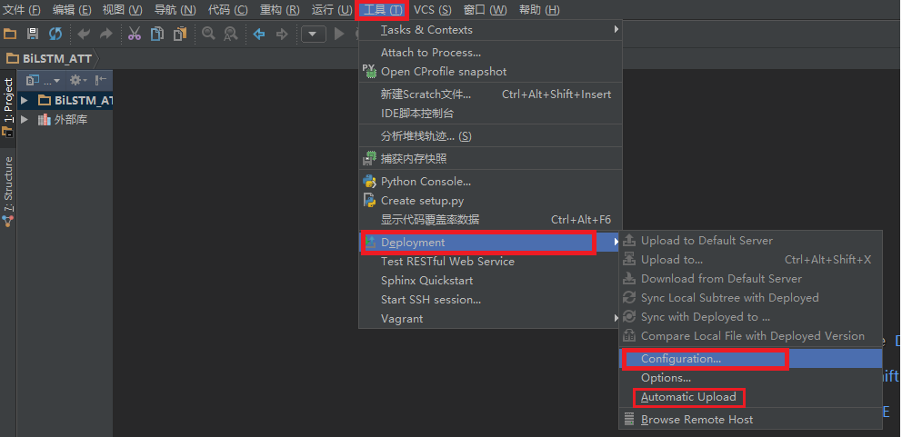
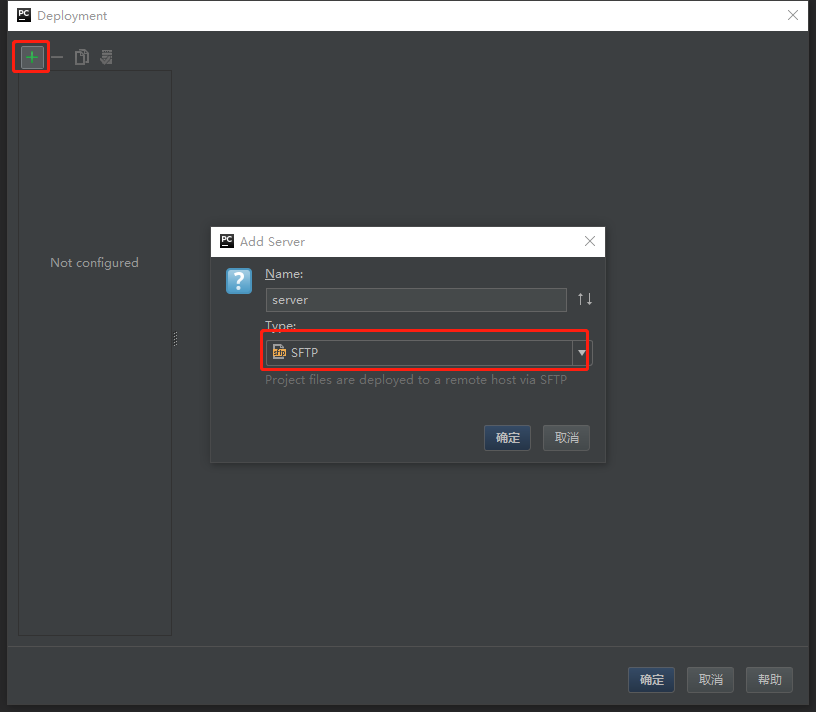
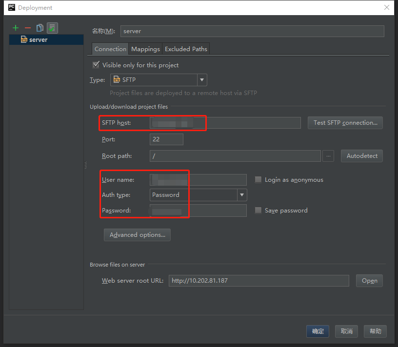
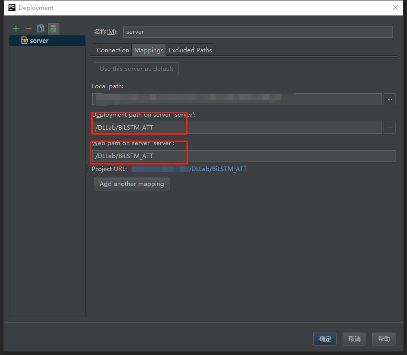

### Step1. 按图中标注选择"Automatic Upload"，这样可以每次使用`Ctrl+s`保存的时候自动上传到服务器。然后点击"Configuration"进行配置

### Step2. 按图所示，增加一个配置

### Step3. 这里"SFTP host"填写服务器ip地址，然后填写一些信息

### Step4. 注意这里部分的配置，这里是确定代码同步到服务器的目录结构，点击最右侧"..."直接在弹窗中选择即可。第二个红框内把第一个红框的内容复制一遍就ok，具体的配置我也不了解为啥。

